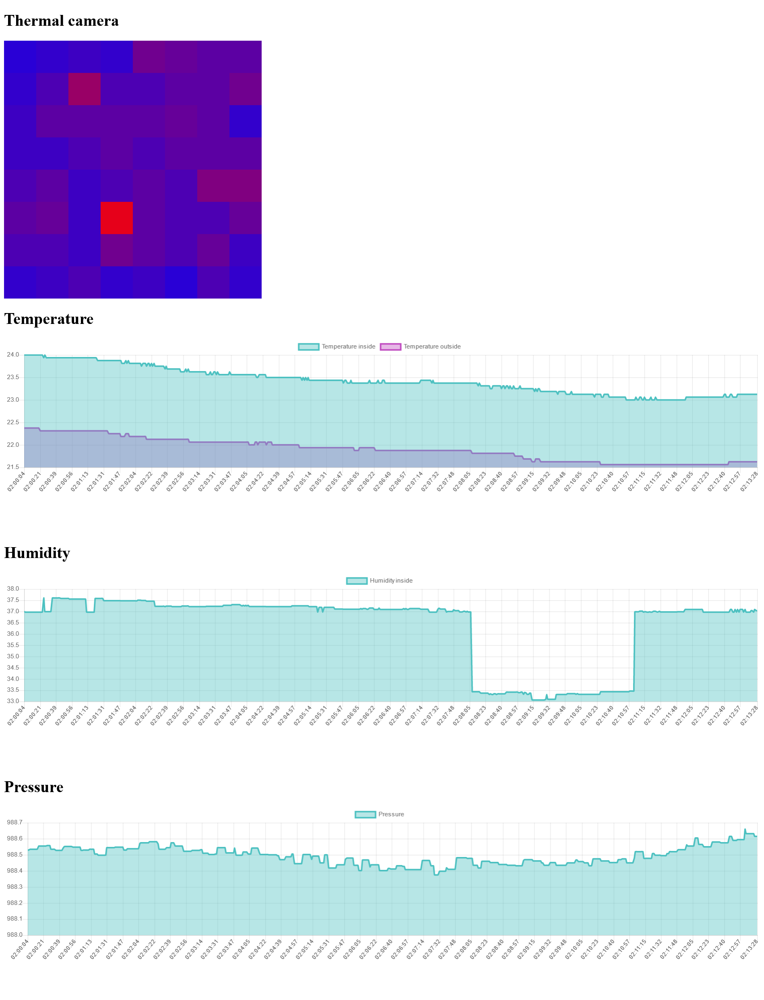
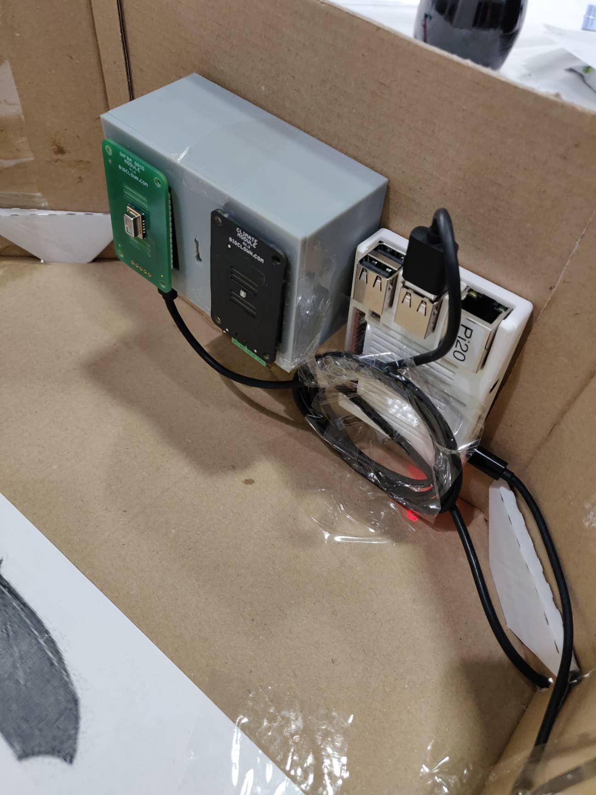

# Junior Hackathon 2018 tým Meltdown
[Organizátor](https://jaczech.org/novinky/posts/2018/october/junior-hackathon-2018-v%C3%BDzva-pro-program%C3%A1torsk%C3%A9-talenty/)
[Článek s výpisem týmů](https://www.hackathons.cz/looking-back-to-junior-hackathon-2018/)
Ujal jsem se vedení a navazal jsem na práci týmu HobbyRobot. Díky webařům a dalším ajťákům jsme dokázali celý koncept posunout na výšší úroveň. 
Podařilo se nám vytvořit plně funkční sensorovou soustavu, která posilala data na server. server generoval webovou stránku se streamem dat.
## Senzory:
- teplota a vlhkost uvnitř a mimo netopýří budku
- senzor tlaku
- Infračervený kamerový senzor s rozlišením 8x8 pixelů

## [webová stránka](https://bat.woltvint.cz/)
Kde jsme data v reáném čase zobrazovali.

## Netopýří budka
Z krabic od pizze

## Elektronika
BigClown ([Dnes HARDWARIO](https://www.hardwario.com/cs/)) jsme použili komponenty jako sensorovou soustavu.
Raspberry pi jsme použili k přeposilaní det.
A napajeli jsme to powerbankou.

## Závěr
Všech vytýčených cilů jsme za těch 24 hodin dosáhli.
!Kvalitní/spolehlivá IoT aplikaci nelze dělat bez webaře, který zajistí prezentaci dat!