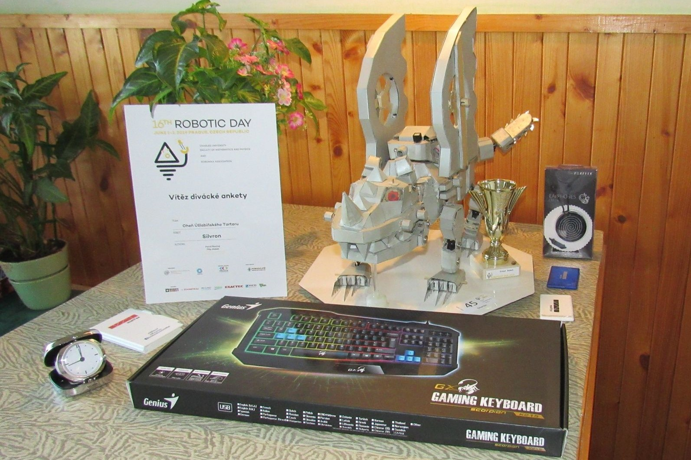

# Silvron

Ke spolupráci s Filipem Maškem jsem se dostal relativně krátce před zahajením soutěže. Silvron byl v té době bez křídel([jako je na fotkách z přihlášky](http://robotickyden.cz/2019/seznam-robotu/?competition=FS)), ale plánoval je vyrobit.
Já jsem pouze navhnul, vytvořil a naprogramoval elektroniku v křídlech.
Na soutěži jsem natočil prezentační [video](https://youtu.be/JPhYR3HqWhY), kde je mnoho věcí popsáno.

## obrázky
Robot na výstavce a s cenamy

Detail se složenými křídly

Silvron s aktivonanými funkcemi

detail diplomu

## Poznánky
- Pro rozšíření výstupů a rozšíření vstupních tlačítek jsem použil technologii posuvného registru.
- Motory byly na 3,3V. Proto byly napojeny přímo z H-mustku přes 5V napajení Arduina. Měl jsem s tím občas problémy, hlavně při komunikaci přes serialovou linku.
