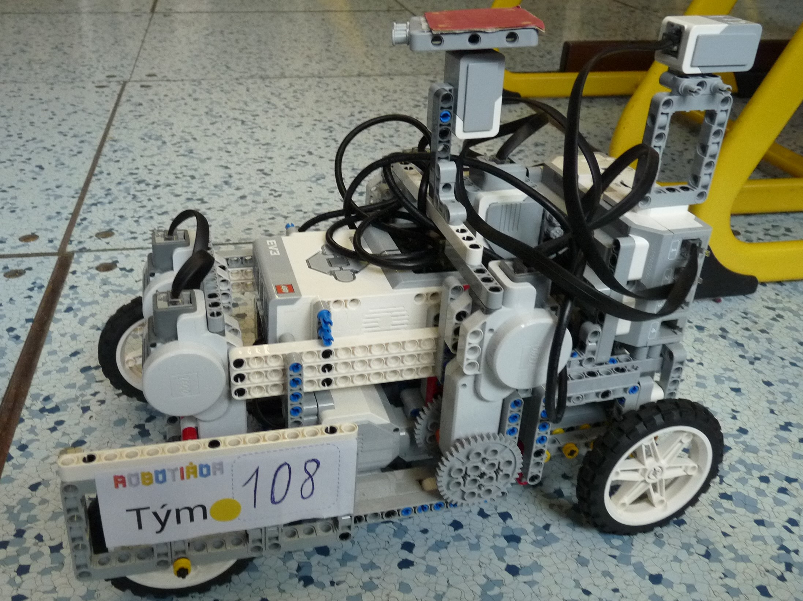
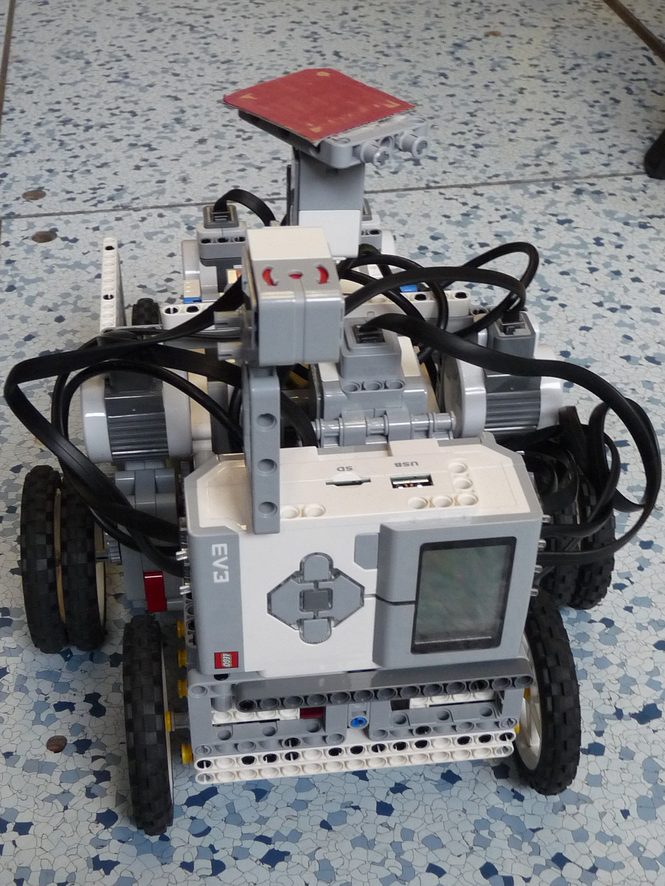
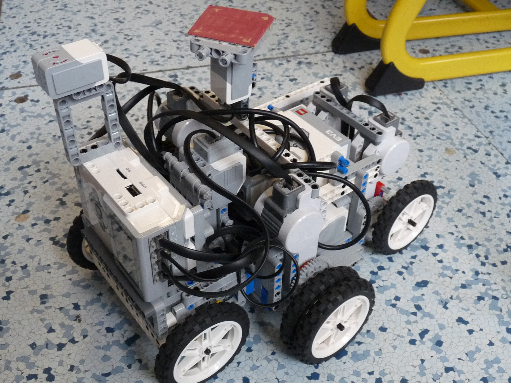
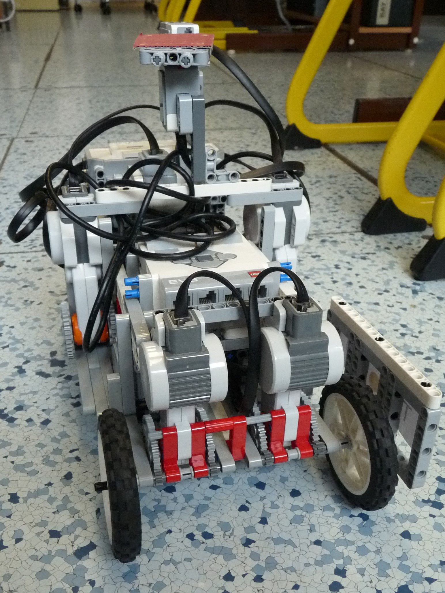
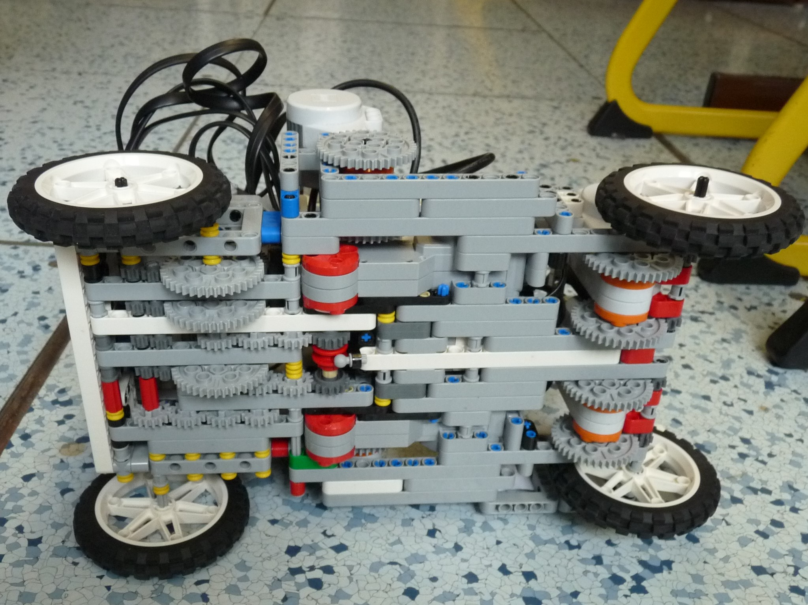
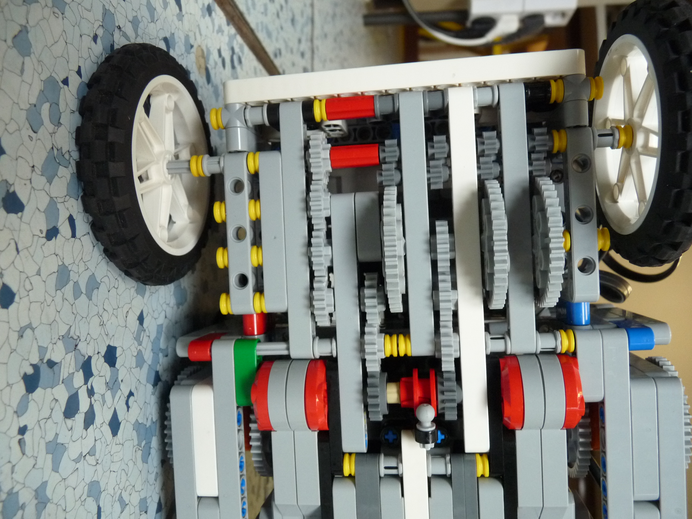
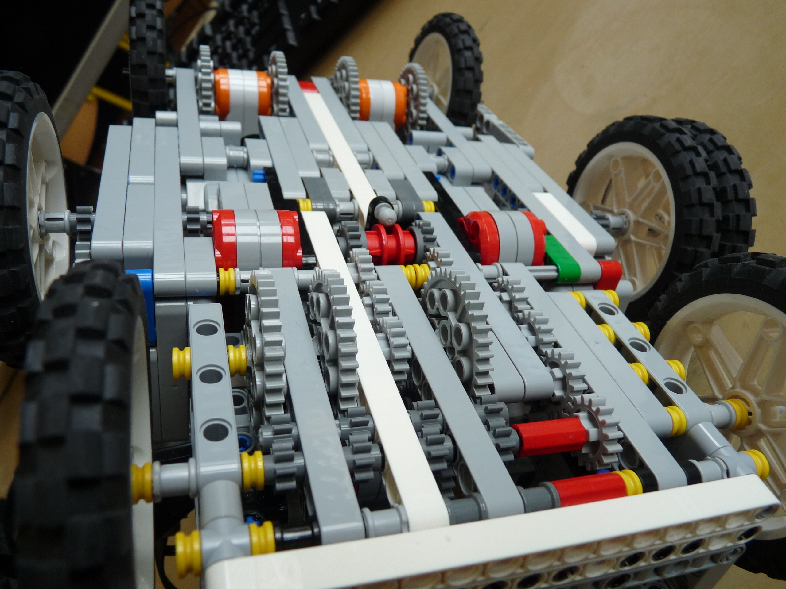
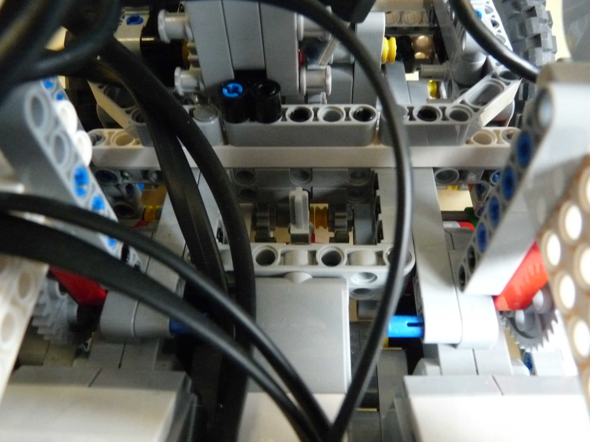
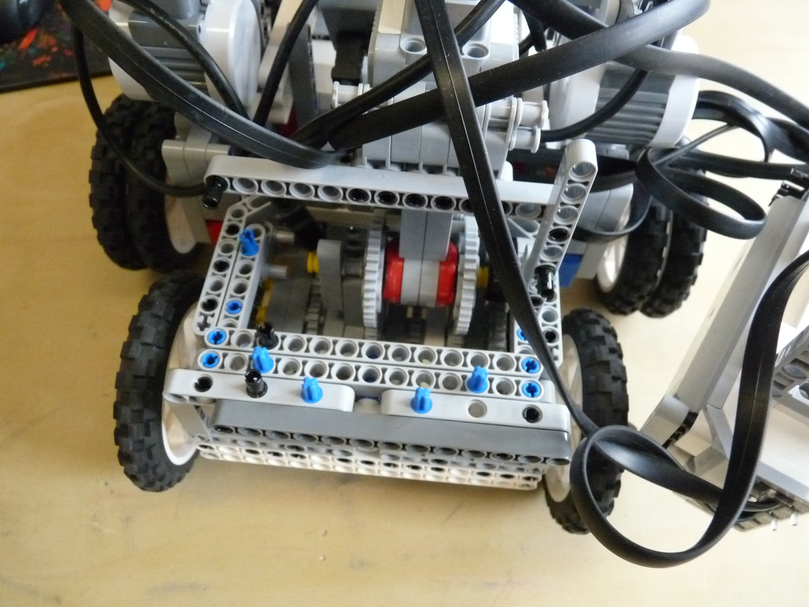
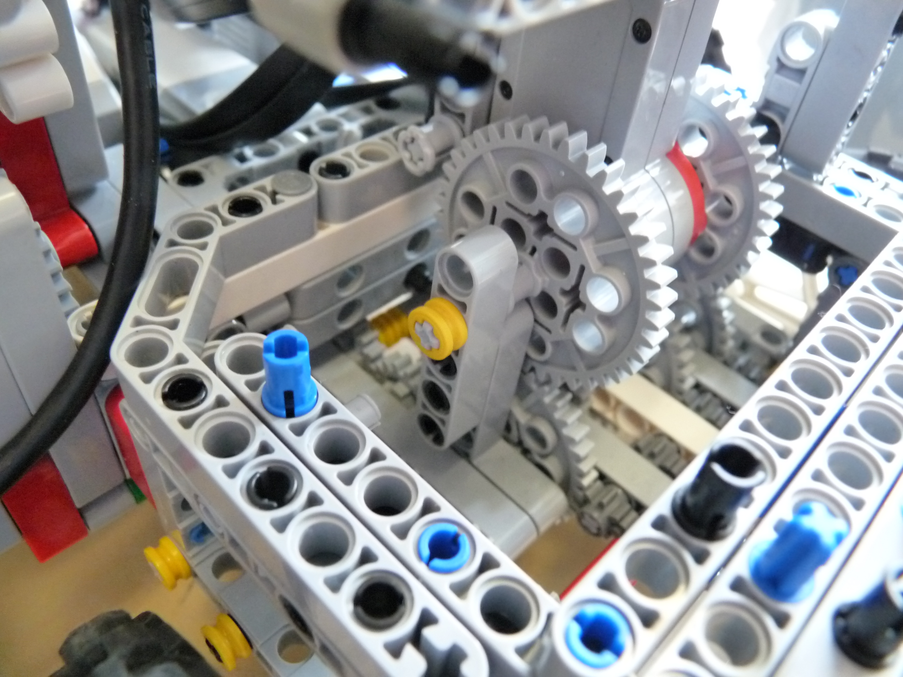

# Užlabinos
Se spolužáky jsem se zučastnil [Robotiady](https://robotiada.cz/) v 2019. Já jsem dělal na robotovi pro [SPRINT](https://docs.google.com/spreadsheets/d/1w59QGPwkrG8gr4lbZo96pJLWGmmyXTDxJVfM12Oplos/edit#gid=242107317).
Robot měl masivní konstukci, abych nemusel přiliš měnit směr spomalováním jednoho z motorů. Řízení směru bylo zajišěno zadními motory. Nebyly spojeny. Měly převod 1:4 (Otačka motoru/kolo). Změnou(Zpomalování) jejich výkonu jsem měnil směr. 
Přední kola byla na společné ose. Jeden motor byl zde v poměru 1:4 a potom čtyři motory na jedné ose byly spojeny převodovkou s převodem 1:1, který se použival ke startu a pomer 1:4, který se po startu přepnul.
Osmý motor zajišťoval přepnutí převodovky.
Gyroskop se kvůli blizkosti motorů  pravidelně špatně kalibroval. Proto jsem vymyslel  alarm před startem. 
## Postup:
1. Zapnul jsem obě kostky
2. Zapnul jsem program
3. Nastavil jsem robota na start. Přitom jsem s ním hýbal. 
    - Pokuď se neozval alarm, vše se opakovalo od 1. kroku a následovala kontrola kabelů.
    - Pokuď alalrm po té co se robot přestal hýbat nepřestal znít, vše se opakuje od 1.kroku.
4. Velkým tlačítkem odstartováno.

## Fotky

